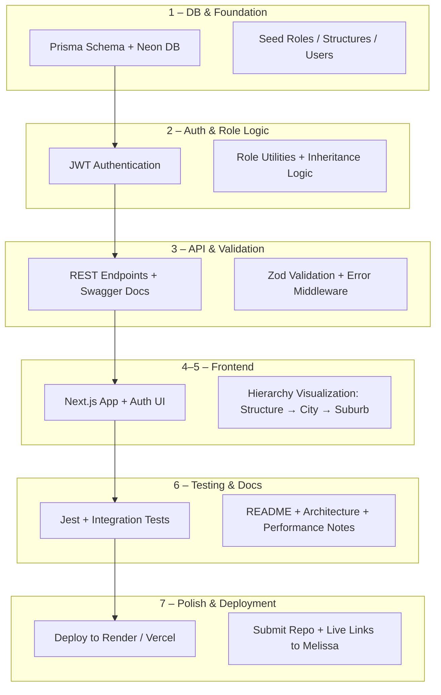

# PlusPlusMinus-HPMS
plusplusminus PPM-FS-Challenge

## Trello

```
https://trello.com/b/dy9uG8Vx/plusplusminus
```

## backend

### Neon

```
https://console.neon.tech/app/projects/calm-dream-36516261/auth?tab=configuration
```

```
npx dotenv -e .env -- npx prisma generate

npx dotenv -e .env -- npx prisma migrate dev --name add-user-model
```

```
Loaded Prisma config from prisma.config.js.

Prisma config detected, skipping environment variable loading.
Prisma schema loaded from prisma\schema.prisma
Datasource "db": PostgreSQL database "neondb", schema "public" at "ep-floral-base-abz6128n-pooler.eu-west-2.aws.neon.tech"
```

```
npx dotenv -e .env -- npx prisma studio
http://localhost:5555/

Regenerate prisma client:
npx dotenv -e .env -- npx prisma generate

Run the seed:
npx dotenv -e .env -- node --loader ts-node/esm seed.ts

Or via Prisma hook:
npx prisma db seed
```

