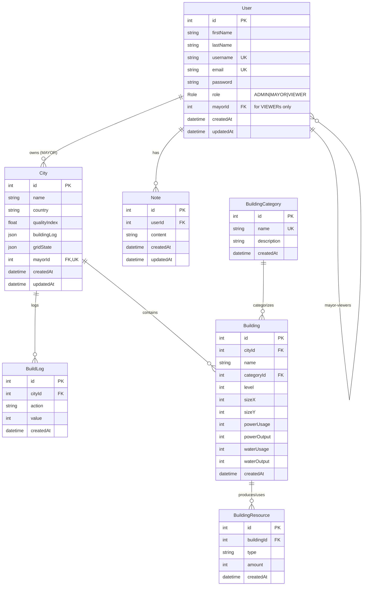

# City Builder: Hierarchical City Simulation & User Management System

<p align="center">
  
</p>

## Backend Installation

```
cd backend
npm install
npm run build
npm run dev
```

## Frontend Installation

```
cd frontend
npm install
npm run build
npm run dev
```

## Tech Stack

| Frontend | Backend | Database | Utilities |
|:---|:---|:---|:---|
|  <br>  <br>  <br>  |  <br>  <br>  |  <br>  |  <br>  |


---

## Overview

**City Builder** is a full-stack simulation and management platform where users — acting as mayors — build and optimize their own cities in a shared hierarchical environment.

The system models city capability, resource distribution, and administrative oversight across three user roles:

- **Admin** — oversees all cities, reviews logs, and monitors global statistics  
- **Mayor** — 3 types of mayors exist. They build their own city, provides services, manages power, water, food, and housing resources  
- **Viewer** — observes city stats in read-only mode  

---

## Key Features

### 1. Dynamic City Dashboard
- Real-time grid visualization 
- Drag-and-drop building placement with live stats update  
- Power, Water, Population, Services, and Food resource cards  
- Automatic recalculation of production, demand, and quality index  

### 2. Role-Based Access & Authentication
- JWT-based authentication (Admin / Mayor / Viewer)  
- Secure route protection and middleware validation  
- Role hierarchy controls backend access and UI visibility  

### 3. Scalable Data Model
- Fully normalized **Prisma schema** connecting:
  - `User` ↔ `City` ↔ `BuildLog` ↔ `Note`
  - `Building` ↔ `BuildingCategory` ↔ `BuildingResource`
- Seeded data for testing with 20 hierarchical users (all use password `Password123!`):

#### Admin Users
| Role | Email | Access Level |
|------|--------|--------------|
| **Admin** | `admin@example.com` | Full system access |

#### National Level Mayors (All Buildings)
| Role | Email | City Assignment | Building Access |
|------|--------|-----------------|-----------------|
| **National Mayor** | `national1@example.com` | National Capital - National1's District | All 8 building types |
| **National Mayor** | `national2@example.com` | National Capital - National2's District | All 8 building types |

#### City Level Mayors (6 Building Types)
| Role | Email | City Assignment | Building Access |
|------|--------|-----------------|-----------------|
| **City Mayor** | `citya1@example.com` | City A | Commercial, Emergency, Energy, Utilities, Residential, Agriculture |
| **City Mayor** | `citya2@example.com` | City A | Commercial, Emergency, Energy, Utilities, Residential, Agriculture |
| **City Mayor** | `cityb1@example.com` | City B | Commercial, Emergency, Energy, Utilities, Residential, Agriculture |
| **City Mayor** | `cityb2@example.com` | City B | Commercial, Emergency, Energy, Utilities, Residential, Agriculture |

#### Suburb Level Mayors (2 Building Types)
| Role | Email | City Assignment | Building Access |
|------|--------|-----------------|-----------------|
| **Suburb Mayor** | `suburb_a11@example.com` | Suburb A1 Township | Residential, Agriculture only |
| **Suburb Mayor** | `suburb_a12@example.com` | Suburb A1 Township | Residential, Agriculture only |
| **Suburb Mayor** | `suburb_a21@example.com` | Suburb A2 Township | Residential, Agriculture only |
| **Suburb Mayor** | `suburb_a22@example.com` | Suburb A2 Township | Residential, Agriculture only |
| **Suburb Mayor** | `suburb_b11@example.com` | Suburb B1 Township | Residential, Agriculture only |
| **Suburb Mayor** | `suburb_b12@example.com` | Suburb B1 Township | Residential, Agriculture only |
| **Suburb Mayor** | `suburb_b21@example.com` | Suburb B2 Township | Residential, Agriculture only |
| **Suburb Mayor** | `suburb_b22@example.com` | Suburb B2 Township | Residential, Agriculture only |

#### Viewers (Read-Only Access)
| Role | Email | Access Level |
|------|--------|--------------|
| **Viewer** | `viewer1@example.com` | Read-only access to all cities |
| **Viewer** | `viewer2@example.com` | Read-only access to all cities |
| **Viewer** | `viewer3@example.com` | Read-only access to all cities |
| **Viewer** | `viewer4@example.com` | Read-only access to all cities |
| **Viewer** | `viewer5@example.com` | Read-only access to all cities |

### 4. Modular Architecture
- **Frontend:** Next.js + Styled-Components for modern, component-driven design  
- **Backend:** Express + Prisma + Neon PostgreSQL

```
npx dotenv -e .env -- npx prisma studio
http://localhost:5555/
```

- **Clean separation:** `/controllers`, `/services`, `/routes`, `/middlewares`, `/validators`

### 5. UI Design
- Sleek dark UI
- Draggable isometric building icons for each category  
- Consistent color palette mapping to resource types:  
  - **Power** → `#FFD52B`  
  - **Water** → `#0068FF`  
  - **Population** → `#2FBF4A`  
  - **Services** → `#EE3E36`  
  - **Food** → `#704214`  

---

### Swagger

live version:
https://passionate-contentment-production.up.railway.app/api/docs/

Open the Swagger UI in your browser:
http://localhost:4000/api/docs

Raw OpenAPI JSON:
http://localhost:4000/api/docs/json




## Trello

https://trello.com/b/dy9uG8Vx/plusplusminus

### Neon

https://console.neon.tech/app/projects/calm-dream-36516261/auth?tab=configuration
