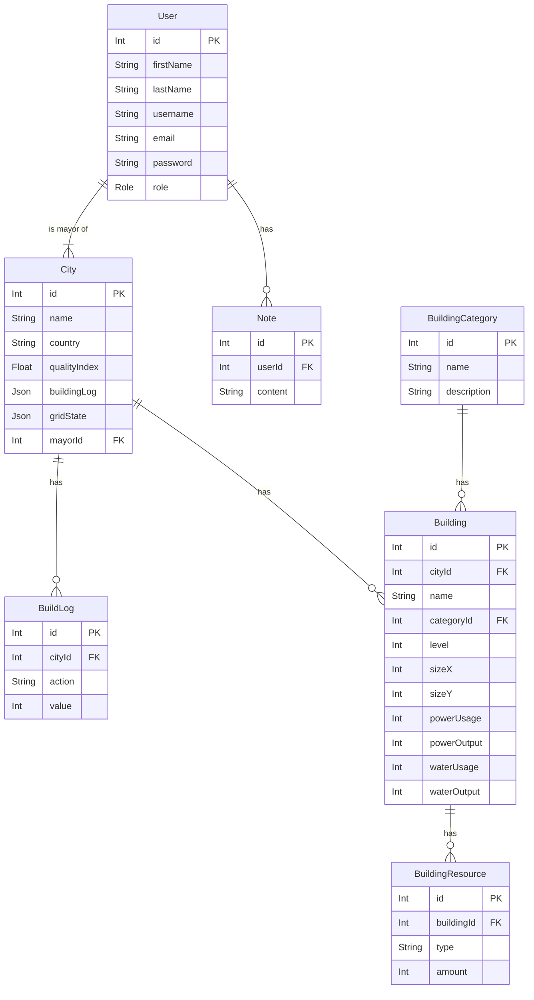

# PlusPlusMinus: Hierarchical City Simulation & User Management System

<p align="center">
  
</p>


## Tech Stack

| Frontend | Backend | Database | Utilities |
|:---|:---|:---|:---|
|  <br>  <br>  <br>  |  <br>  <br>  |  <br>  |  <br>  |


---

## Overview

**PlusPlusMinus** is a full-stack simulation and management platform where users — acting as mayors — build and optimize their own cities in a shared hierarchical environment.

The system models city growth, resource distribution, and administrative oversight across three user roles:

- **Admin** — oversees all cities, reviews logs, and monitors global statistics  
- **Mayor** — builds their own city grid, manages power, water, food, and housing resources  
- **Viewer** — observes city stats in read-only mode  

Every action — from building placement to resource consumption — is tracked, logged, and visualized through an intelligent, responsive dashboard.

---

## Key Features

### 1. Dynamic City Dashboard
- Real-time grid visualization (11 × 9 blocks)  
- Drag-and-drop building placement with live stats update  
- Power, Water, Population, Services, and Food resource cards  
- Automatic recalculation of production, demand, and quality index  

### 2. Role-Based Access & Authentication
- JWT-based authentication (Admin / Mayor / Viewer)  
- Secure route protection and middleware validation  
- Role hierarchy controls backend access and UI visibility  

### 3. Scalable Data Model
- Fully normalized **Prisma schema** connecting:
  - `User` ↔ `City` ↔ `BuildLog` ↔ `Note`
  - `Building` ↔ `BuildingCategory` ↔ `BuildingResource`
- Seeded demo data for testing with default users:

| Role | Email | Password |
|------|--------|-----------|
| **Admin** | `admin@example.com` | `Password123!` |
| **Mayor** | `mayor@example.com` | `Password123!` |
| **Viewer** | `viewer@example.com` | `Password123!` |

### 4. Modular Architecture
- **Frontend:** Next.js + Styled-Components for modern, component-driven design  
- **Backend:** Express + Prisma + Neon PostgreSQL

```
npx dotenv -e .env -- npx prisma studio
http://localhost:5555/
```

- **Clean separation:** `/controllers`, `/services`, `/routes`, `/middlewares`, `/validators`

### 5. UI Design
- Sleek dark-mode interface with 2 px white grid outlines  
- Animated isometric building icons for each category  
- Consistent color palette mapping to resource types:  
  - **Power** → `#FFD52B`  
  - **Water** → `#0068FF`  
  - **Population** → `#2FBF4A`  
  - **Services** → `#EE3E36`  
  - **Food** → `#704214`  

---

## Deployment & CI/CD

This project includes a comprehensive CI/CD pipeline for automated testing, building, and deployment.

### Quick Start with Docker

1. **Clone the repository:**
   ```bash
   git clone <your-repo-url>
   cd plusplusminus-hpms
   ```

2. **Set up environment variables:**
   ```bash
   cp .env.example .env
   # Edit .env with your database URL and secrets
   ```

3. **Run with Docker Compose:**
   ```bash
   # Development environment
   docker-compose up --build

   # Production environment
   docker-compose -f docker-compose.prod.yml up --build
   ```

### CI/CD Pipeline

The project uses GitHub Actions for continuous integration and deployment:

- **Automated Testing:** Runs on every push to `main` and pull requests
- **Multi-stage Docker Builds:** Optimized containerization for both frontend and backend
- **Cloud Deployment:** Automatic deployment to Railway (backend) and Vercel (frontend)
- **Health Checks:** Post-deployment verification of all services

#### GitHub Secrets Required

Set these secrets in your GitHub repository settings:

```
RAILWAY_TOKEN        # Railway CLI token
VERCEL_TOKEN         # Vercel deployment token
VERCEL_PROJECT_ID    # Vercel project ID
VERCEL_ORG_ID        # Vercel organization ID
DATABASE_URL         # Production database URL
JWT_SECRET           # JWT signing secret
```

#### Deployment Scripts

- `scripts/deploy.sh` - Manual deployment script
- `scripts/docker-deploy.sh` - Docker-based deployment
- `scripts/health-check.sh` - Service health verification

For detailed deployment instructions, see [DEPLOYMENT.md](./DEPLOYMENT.md).

---

## Trello

```
https://trello.com/b/dy9uG8Vx/plusplusminus
```

### Neon

```
https://console.neon.tech/app/projects/calm-dream-36516261/auth?tab=configuration
```

### Swagger

Start the server:

```
npm run build
npm run dev
```

Open the Swagger UI in your browser:
http://localhost:4000/api/docs

Raw OpenAPI JSON:
http://localhost:4000/api/docs/json

### Public API endpoints

- GET /api/public/mayors
    - Returns a list of users with role `MAYOR`. This endpoint is intentionally public (no authentication required) to allow the frontend registration page to fetch available mayors for new Viewer accounts.
    - Response shape (example):
        ```json
        [
            {
                "id": 1,
                "firstName": "Alice",
                "lastName": "Anderson",
                "role": "MAYOR",
                "city": { "name": "ZedTown", "country": "X", "qualityIndex": 42 },
                "notes": [{ "id": 1 }]
            }
        ]
        ```
    - Usage: the frontend registration form calls `/api/public/mayors` to populate a required mayor selector when creating a Viewer account. If you change the route prefix in the server, update `frontend/lib/axios.ts` or `frontend/components/organisms/RegisterForm.tsx` accordingly.


