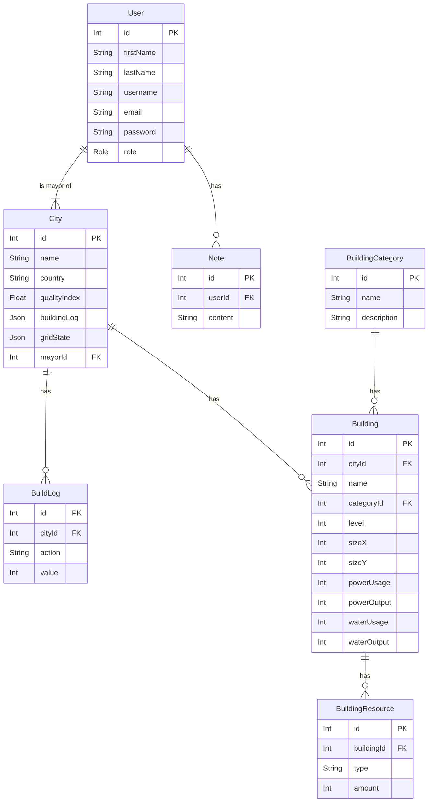

```mermaid
erDiagram
    User {
        Int id PK
        String firstName
        String lastName
        String username
        String email
        String password
        Role role
    }

    City {
        Int id PK
        String name
        String country
        Float qualityIndex
        Json buildingLog
        Json gridState
        Int mayorId FK
    }

    BuildLog {
        Int id PK
        Int cityId FK
        String action
        Int value
    }

    Note {
        Int id PK
        Int userId FK
        String content
    }

    BuildingCategory {
        Int id PK
        String name
        String description
    }

    Building {
        Int id PK
        Int cityId FK
        String name
        Int categoryId FK
        Int level
        Int sizeX
        Int sizeY
        Int powerUsage
        Int powerOutput
        Int waterUsage
        Int waterOutput
    }

    BuildingResource {
        Int id PK
        Int buildingId FK
        String type
        Int amount
    }

    User ||--o{ Note : "has"
    User ||--|{ City : "is mayor of"
    City ||--o{ BuildLog : "has"
    City ||--o{ Building : "has"
    BuildingCategory ||--o{ Building : "has"
    Building ||--o{ BuildingResource : "has"

```
