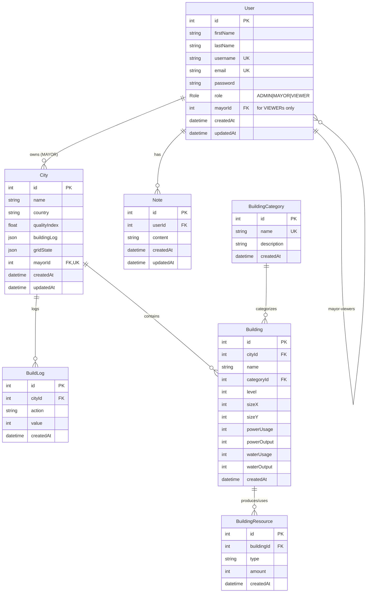

```mermaid
erDiagram
    User ||--o{ City : "owns (MAYOR)"
    User ||--o{ User : "mayor-viewers"
    User ||--o{ Note : "has"
    City ||--o{ BuildLog : "logs"
    City ||--o{ Building : "contains"
    BuildingCategory ||--o{ Building : "categorizes"
    Building ||--o{ BuildingResource : "produces/uses"

    User {
        int id PK
        string firstName
        string lastName
        string username UK
        string email UK
        string password
        Role role "ADMIN|MAYOR|VIEWER"
        int mayorId FK "for VIEWERs only"
        datetime createdAt
        datetime updatedAt
    }

    City {
        int id PK
        string name
        string country
        float qualityIndex
        json buildingLog
        json gridState
        int mayorId FK,UK
        datetime createdAt
        datetime updatedAt
    }

    BuildLog {
        int id PK
        int cityId FK
        string action
        int value
        datetime createdAt
    }

    Note {
        int id PK
        int userId FK
        string content
        datetime createdAt
        datetime updatedAt
    }

    BuildingCategory {
        int id PK
        string name UK
        string description
        datetime createdAt
    }

    Building {
        int id PK
        int cityId FK
        string name
        int categoryId FK
        int level
        int sizeX
        int sizeY
        int powerUsage
        int powerOutput
        int waterUsage
        int waterOutput
        datetime createdAt
    }

    BuildingResource {
        int id PK
        int buildingId FK
        string type
        int amount
        datetime createdAt
    }
```